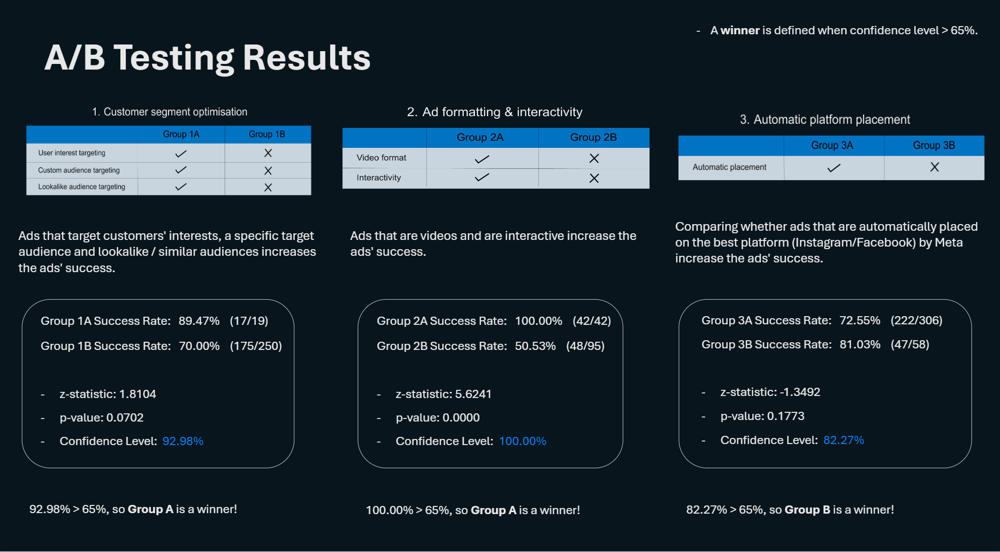

<h1>📊 A/B Testing Analysis on Meta's Ad Dataset: Sportswear Brand (UK Market)</h1>

This project analyses A/B testing results to identify effective marketing strategies for a sportswear brand targeting the UK market. We explore the impact of customer segment optimization, ad formatting & interactivity, and automatic platform placement on ad success rates.

<h2>Table of Contents</h2>

<ul>
    <li><a href="#key-findings" target="_blank">Key Findings</a></li>
    <li><a href="#project-overview" target="_blank">Project Overview</a></li>
    <li><a href="#data-methodology" target="_blank">Data and Methodology</a></li>
    <li><a href="#ab-testing-results" target="_blank">A/B Testing Results</a></li>
    <li><a href="#recommendations" target="_blank">Recommendations</a></li>
    <li><a href="#contributing" target="_blank">Contributing</a></li>
    <li><a href="#license" target="_blank">Licence</a></li>
</ul>

<!-- Add the image reference for recommendations -->

<h3 id="key-findings">Key Findings</h3>

<ul>
    <li>Ads that were videos and interactive performed almost 50% better than those that were not.</li>
    <li>Of the 42 ads studied that were videos and interactive, 100% of these successfully achieved their advert objectives.</li>
    <li>Ads that were automatically posted on the best social media platforms by Meta performed 8.43% worse in achieving ad objectives</li>
    <li>Ads that had customer segment optimisation performed 19.47% better than ads without it.</li>
</ul>

<!-- Add the image reference for results --> 
<!--   -->

<h3 id="project-overview">Project Overview</h3>

This project aims to optimise marketing campaigns for a sportswear brand in the UK market. I analysed A/B testing results to understand the effectiveness of different ad strategies, including customer segmentation, ad formatting, and platform selection.

<h3 id="data-methodology">Data and Methodology</h3>

The analysis utilises data from an A/B testing experiment conducted on a dataset of 67,085 advertisements. Three key tests were performed:

<ol>
    <li><strong>Customer Segment Optimisation:</strong> Compared ad performance based on targeting specific audience segments (interests, custom audiences, lookalikes) vs. a broader audience.</li>
    <li><strong>Ad Formatting & Interactivity:</strong> Evaluated the effectiveness of video and interactive ads compared to non-video, non-interactive ads.</li>
    <li><strong>Automatic Platform Placement:</strong> Analysed the success rate of ads automatically placed by Meta vs. those manually placed by the advertiser.</li>
</ol>

<h3 id="recommendations">Recommendations</h3>

<!-- Add the image reference for recommendations -->

<h3 id="contributing">Contributing</h3>

If you would like to contribute to this project, please follow these steps:

<ol>
    <li>Fork the repository.</li>
    <li>Create a new branch:</li>
    <pre><code>git checkout -b feature/YourFeature</code></pre>
    <li>Make your changes and commit them:</li>
    <pre><code>git commit -m "Add some feature"</code></pre>
    <li>Push to the branch:</li>
    <pre><code>git push origin feature/YourFeature</code></pre>
    <li>Open a pull request.</li>
</ol>

<h3 id="license">License</h3>

This project is licensed under the MIT License - see the <a href="LICENSE" target="_blank">LICENSE</a> file for details.

For any questions or issues, please open an issue on GitHub or contact the maintainer.

